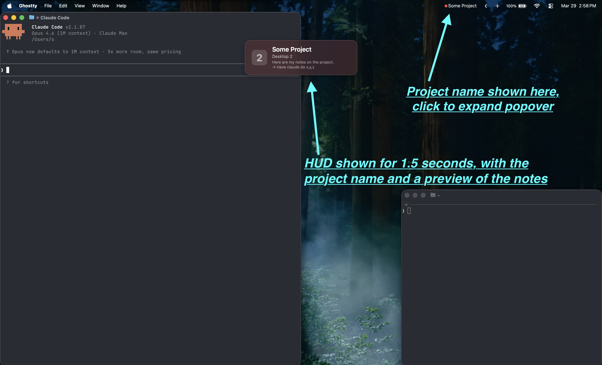
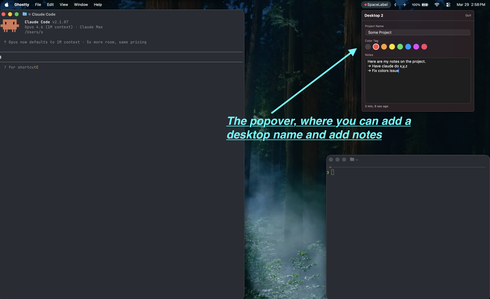
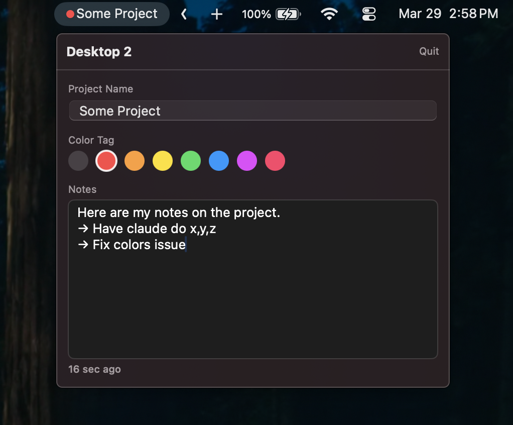

# SpaceLabel

A lightweight macOS menu bar app for naming and organizing your desktop spaces.

## Why

I built SpaceLabel to reduce friction during AI-driven development. When collaborating with AI on projects, I often work on 3–5 projects simultaneously. Each project gets its own macOS desktop space — a terminal for the dev server, a terminal running Claude Code, a browser showing the app, and whatever other windows that project needs. I switch between projects with a touchpad swipe or `Ctrl + Arrow`, and I have two monitors linked so both screens switch together. While Claude chugs away on one project, I swipe over to a different one and keep going.

It works great, except for one thing: it often takes a few seconds to figure out which project I just switched to. I might have an experiment with a new library on one desktop space, changes to my blog on another, and a research agent I'm building on a third. That moment of figuring out where I am is a small friction, but it happens countless times and small frictions compound.

macOS gives you nothing here. Desktop spaces are just numbers in Mission Control. No labels, no context, no memory of what you were doing there.

SpaceLabel fixes that. It's a menu bar app that lets me name my desktop spaces and shows a HUD overlay when I swipe to one. A translucent panel flashes the project name and a preview of my notes. I swipe, I see "Testing Library" or "Blog" or "Research Agent" and I know where I am.

## Features

- **Name your spaces** — give each desktop space a project name like "Blog Redesign" or "Tax Prep"
- **Saved projects** — save a label as a reusable project, then assign it to any desktop from a dropdown; its name, notes, and color follow the project
- **Project management** — delete saved projects with confirmation; assigned spaces return to their local labels
- **Automatic color per space** — each space is assigned one of 7 colors automatically (and you can override it); shown as a tint on the HUD, in the popover, and in the menu bar
- **Menu bar indicator** — choose in Settings how the space color shows next to the menu bar label: a colored dot before the name, a colored underline beneath it, or none
- **Popover sizes** — choose Small (300 x 360), Medium (340 x 440), or Large (400 x 560) in Settings
- **Notes** — free-form notes per space; expandable to fill most of the screen with the toggle in the Notes header
- **HUD overlay** — instantly shows the space name, number, notes preview, and color tint when you switch desktops
- **Global hotkey** — `Control + /` toggles the popover from anywhere
- **Persistent popover** — remains visible when you switch to another application or window; click the menu bar label again or press Escape to close it
- **Escape to close** — press Escape to save and dismiss
- **Persistent** — names, notes, and colors survive app restarts and reboots (stored in UserDefaults). Notes autosave while you type, so edits are not lost if the app quits with the popover open
- **Space lifecycle** — automatically detects when spaces are added or removed and cleans up orphaned profiles

## Screenshots







## Requirements

- macOS 15.0+
- Apple Silicon (arm64)

## Install

### Build from source

```bash
git clone https://github.com/SeanLikesData/SpaceLabel.git
cd SpaceLabel
./Scripts/build.sh
```

The build script compiles with `swiftc`, assembles a `.app` bundle, and launches it. The resulting app is at `.build/SpaceLabel.app`.

To install permanently:

```bash
cp -r .build/SpaceLabel.app /Applications/
```

To start on login: **System Settings > General > Login Items > "+" > SpaceLabel**

## How It Works

SpaceLabel uses Apple's private CoreGraphics Server (CGS) APIs to detect desktop spaces — there's no public API for this. Functions like `CGSGetActiveSpace` and `CGSCopyManagedDisplaySpaces` are called via Swift's `@_silgen_name` attribute, avoiding the need for a C bridging module.

The app listens for `NSWorkspace.activeSpaceDidChangeNotification` to detect space switches in real time, and polls every 10 seconds to catch space additions/removals (which don't fire notifications).

The HUD overlay uses a borderless `NSPanel` with `canJoinAllSpaces` so it appears on every desktop. The menu bar color dot is rendered as a non-template `NSImage` to bypass macOS's monochrome template rendering.

### Build system note

The project uses `swiftc` directly rather than Swift Package Manager due to a bug in the macOS Command Line Tools where a duplicate `SwiftBridging` module map causes compilation failures. The build script creates a patched toolchain symlink tree as a workaround.

## Project Structure

```
Sources/SpaceLabel/
├── App/
│   ├── SpaceLabelApp.swift    # AppKit @main entry
│   ├── AppState.swift         # Central state: detector + store + HUD via Combine
│   ├── AppSettings.swift      # UserDefaults-backed preferences (popover size, notes height, menu bar indicator)
│   └── AppDelegate.swift      # Status item, persistent panel, menu label, and hotkey
├── Space/
│   ├── SpaceDetector.swift    # CGS private API wrapper for space detection
│   └── SpaceInfo.swift        # Space data model (UUID, managedID, index, display)
├── Storage/
│   ├── SavedProject.swift     # Reusable project model with persistent notes and color
│   ├── SpaceProfile.swift     # Per-space local profile and optional project assignment
│   └── SpaceDataStore.swift   # UserDefaults persistence for profiles and projects
├── Views/
│   ├── SpaceListView.swift    # Popover container (detail or settings)
│   ├── SpaceDetailView.swift  # Edit name, notes, color tag; autosave
│   └── SettingsView.swift     # Popover size and menu bar indicator pickers
└── HUD/
    ├── HUDView.swift          # SwiftUI HUD with vibrancy + color tint
    ├── HUDPanel.swift         # Borderless NSPanel configuration
    └── HUDController.swift    # Show/hide lifecycle with timer
```

## License

MIT
